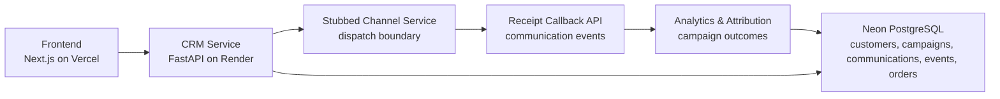

# SonarIQ

SonarIQ is an AI-assisted CRM and campaign intelligence prototype built for the Xeno assignment. It helps a marketer move from customer segmentation to campaign launch, communication lifecycle tracking, attribution, analytics, and AI-assisted insight discovery.

The project focuses on demonstrating a clear full-stack product slice rather than a production-scale marketing platform. It keeps the workflow inspectable, the services separated, and the data model simple enough to evaluate quickly.

## Project Overview and Problem Statement

Modern marketers need to answer practical questions quickly:

- Which customers match a campaign idea?
- How many people will the campaign reach?
- What message should be sent?
- Did the communication get delivered, opened, read, clicked, or fail?
- Which orders and revenue can be attributed back to the campaign?
- Can a non-technical user ask these questions in natural language?

SonarIQ was built to model that workflow end to end. The application combines a Next.js frontend, a FastAPI CRM service, lifecycle receipt processing, attribution logic, analytics APIs, and a lightweight AI chat interface.

## Marketer Workflow

1. A marketer creates a campaign with a channel, goal, and message template.
2. The marketer defines a customer segment using filters such as city, lifetime spend, order count, dormancy, and recent product purchase.
3. The CRM previews the audience size and explains the applied filters.
4. The campaign is launched to matching customers as individual communication records.
5. Engagement events are simulated and persisted through the communication event infrastructure.
6. Analytics and attribution views summarize delivery, engagement, conversions, attributed orders, and revenue.
7. The AI chat interface helps inspect segments, campaign analytics, and campaign insight using natural-language prompts.

## Key Features

- Customer segmentation with SQL-backed filters and explainability.
- Campaign creation, preview, and launch flow.
- Personalized campaign messages using `{first_name}` template substitution.
- Communication lifecycle events for delivered, opened, read, clicked, and failed states.
- Receipt-style event processing using the existing communication event model.
- Campaign analytics with delivery, open, read, click, failure, conversion, order, and revenue metrics.
- Attribution of orders and revenue back to campaign communications.
- Dashboard overview KPIs across the full database history.
- Recent campaign and activity feed views for a compact demo experience.
- AI chat for segment previews, analytics overview, campaign analytics, and campaign insight.

## Tech Stack

| Layer | Technology |
| --- | --- |
| Frontend | Next.js, React, TypeScript, Tailwind CSS, Recharts |
| CRM API | FastAPI, Pydantic, SQLAlchemy |
| Database | Neon PostgreSQL |
| Migrations | Alembic |
| AI Interface | Backend chat orchestration with deterministic intent parsing |
| Deployment | Vercel for frontend, Render for backend service, Neon for managed PostgreSQL |

## Deployment Architecture



The repository keeps the channel-service boundary explicit so the communication path remains understandable: the CRM owns campaigns, communications, receipts, analytics, and attribution, while the channel layer is represented as a stubbed service boundary for assignment scope.

## Communication Lifecycle

```text
Campaign Launch
  -> Communication Dispatch
  -> Delivered / Opened / Read / Clicked / Failed Events
  -> Receipt Processing
  -> Analytics and Attribution Updates
```

Lifecycle events are persisted as `communication_events` and linked to individual communication records. Campaign analytics read from this event history, so historical campaigns remain accessible while the dashboard can focus on recent campaign activity.

The simulated engagement behavior is intentionally realistic for a demo:

- Delivered and failed events follow the existing delivery simulation.
- Opened events follow the existing open simulation.
- Read events occur for a realistic subset of opened communications.
- Clicked events remain based on opened/read engagement.
- Attributed orders and revenue are derived from the existing attribution model.

## AI-Native Development Workflow

SonarIQ was developed using an AI-native workflow with human ownership of product and engineering decisions:

- Prompt-driven development was used to accelerate feature scaffolding, implementation, and documentation.
- Iterative refinement helped align the UI, API behavior, lifecycle events, and analytics outputs with the assignment requirements.
- Generated outputs were reviewed, integrated, and adjusted manually to preserve architecture, data safety, and workflow continuity.
- Architectural choices, tradeoffs, and scope boundaries remained human-directed.
- AI was used as an acceleration tool, not as an autonomous replacement for engineering judgment.

This mirrors how AI coding tools can be used responsibly in a fast-moving engineering environment: useful for speed and breadth, but still constrained by review, testing, and product intent.

## Tradeoffs and Scale Assumptions

This implementation prioritizes assignment scope, clarity, and demonstrability over production infrastructure complexity.

Important tradeoffs:

- The channel service is stubbed to preserve a clear service boundary without adding unnecessary infrastructure.
- Production systems would separate channel services for independent scaling, provider-specific retry behavior, and operational isolation.
- Idempotency safeguards would be required to prevent duplicate event processing when providers retry callbacks.
- Retry policies would handle transient callback, network, and provider failures.
- Queue-backed processing would be introduced for high-volume dispatch and receipt ingestion.
- Observability would be expanded with structured logs, metrics, tracing, and alerting.
- Authentication, role-based access control, audit logs, and multi-tenant data isolation are intentionally out of scope for this assignment prototype.

## Repository Structure

```text
sonariq/
  crm-service/       FastAPI CRM, segmentation, campaigns, receipts, analytics, attribution, chat
  channel-service/   Stubbed channel-service boundary
  frontend/          Next.js dashboard, campaigns, segmentation, analytics, and chat UI
  docs/              Supporting notes and architecture artifacts
```

## Local Development

Backend:

```bash
cd crm-service
pip install -r requirements.txt
uvicorn app.main:app --reload
```

Frontend:

```bash
cd frontend
npm install
npm run dev
```

Set `DATABASE_URL` for the CRM service and `NEXT_PUBLIC_API_BASE_URL` for the frontend when running against deployed services.

## Evaluation Notes

SonarIQ is designed to demonstrate both FDE and SDE expectations:

- Product thinking through a realistic marketer workflow and concise dashboard.
- Frontend execution through a working Next.js experience.
- Backend execution through FastAPI services, SQLAlchemy models, and PostgreSQL-backed analytics.
- System design awareness through explicit service boundaries and tradeoff documentation.
- AI-native development maturity through transparent use of AI as an engineering accelerator.
